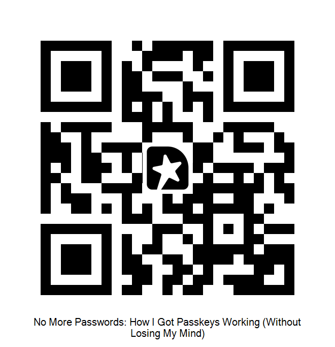

# 🔐 Passkeys Implementation Demo

**Live Demo Companion for Droidcon Abu Dhabi 2025**

> _"The biggest step forward in mobile authentication since... authentication."_

**No slides. Just code, devices, and real implementations.**

---

## 🤝 Connect & Share Your Feedback

### 👤 Connect with me on LinkedIn


---

## 📱 About This Demo

This is the companion repository for my Droidcon Abu Dhabi 2026 presentation on implementing Passkeys in Android. Unlike traditional talks, this session features live demonstrations, real code, and practical solutions to challenges you'll actually face when implementing passkeys.

The project showcases a complete passkey implementation including registration, authentication, WebView integration, and Digital Asset Links configuration—with all the lessons learned along the way.

**Presenter:** Kyriakos Georgiopoulos  
**Event:** Droidcon Abu Dhabi 2026  
**Format:** Live Demo (No Slides)

---

## ✨ What's Demonstrated

- ✅ **Passkey Registration Flow** - Complete user enrollment with Android Credential Manager
- ✅ **Passkey Authentication Flow** - Frictionless sign-in experience
- ✅ **WebView Passkey Integration** - Making passkeys work inside WebViews
- ✅ **Digital Asset Links Configuration** - Domain association setup
- ✅ **Password Flow Comparison** - Side-by-side comparison with traditional auth
- ✅ **Animated Visualizations** - Custom animations explaining passkey concepts

---

## 🏗️ Project Architecture

This is a multi-module Android application following clean architecture principles:

```
Passkeys/
│
├── 📱 app/
│   └── UI layer with Jetpack Compose, live demos, and animated visualizations
│
├── 🔐 auth-credentials/
│   └── Android Credential Manager API wrapper for passkey operations
│
├── 🏛️ domain/
│   └── Business models and use cases (RegistrationOptionsJson, AuthenticationOptionsJson)
│
├── 🌐 network/
│   └── WebAuthn API client with Retrofit and custom serialization
│
├── 💾 data/
│   └── Repository implementations and data sources
│
└── 🧭 navigation/
    └── Compose navigation with custom navigator pattern
```

**Module Responsibilities:**
- **app**: Activities, Compose screens, ViewModels, demo flows
- **auth-credentials**: `PasskeysManager` interface abstracting Credential Manager APIs
- **domain**: Data models for WebAuthn registration/authentication options
- **network**: API definitions and DTOs for backend communication
- **data**: Repository layer bridging network and domain
- **navigation**: Type-safe navigation with navigation commands

---

## 🚀 Getting Started

### Run the Demo

```bash
# 1. Clone the repository
git clone https://github.com/YOUR_USERNAME/Passkeys.git
cd Passkeys

# 2. Open in Android Studio
open -a "Android Studio" .

# 3. (Optional) Configure backend URL
# Create/edit local.properties and add:
# backend.url=https://your-backend-url.com

# 4. Build and deploy to device
# Use Android Studio's Run button or:
./gradlew installDebug

# 5. Follow the in-app demo flow
```

⚠️ **Important**: Passkeys require a physical device for full testing. Emulator support is limited.

---

## 🔗 Digital Asset Links Setup

**Critical Step**: Your app must be associated with your web domain for passkeys to work.

### Step 1: Generate SHA-256 Certificate Fingerprint

```bash
# For debug keystore:
keytool -list -v -keystore ~/.android/debug.keystore -alias androiddebugkey -storepass android -keypass android

# For release keystore:
keytool -list -v -keystore /path/to/release.keystore -alias your-key-alias
```

Copy the SHA-256 fingerprint (format: `AA:BB:CC:DD:...`)

### Step 2: Create assetlinks.json

Create a file at `https://yourdomain.com/.well-known/assetlinks.json`:

```json
[{
  "relation": ["delegate_permission/common.handle_all_urls",
               "delegate_permission/common.get_login_creds"],
  "target": {
    "namespace": "android_app",
    "package_name": "example.passkeys",
    "sha256_cert_fingerprints": [
      "AA:BB:CC:DD:EE:FF:00:11:22:33:44:55:66:77:88:99:AA:BB:CC:DD:EE:FF:00:11:22:33:44:55:66:77:88:99"
    ]
  }
}]
```

### Step 3: Host and Verify

1. Upload to `https://yourdomain.com/.well-known/assetlinks.json`
2. Verify with [Google's Asset Links Tester](https://developers.google.com/digital-asset-links/tools/generator)
3. Ensure HTTPS with valid certificate (self-signed won't work)

### Common Mistakes to Avoid

❌ **Using HTTP instead of HTTPS** - Digital Asset Links require HTTPS  
❌ **Wrong SHA-256 format** - Must include colons: `AA:BB:CC:...`  
❌ **Missing `.well-known/` path** - Must be exactly this path  
❌ **Self-signed certificates** - Use proper CA-signed certificates  
❌ **Package name mismatch** - Must match `applicationId` in `build.gradle`  

---

## 💻 Implementation Highlights

### Passkey Registration

```kotlin
// From PasskeysManagerImpl.kt
override suspend fun register(
    activity: Activity,
    requestJson: String
): Result<PublicKeyResponseJson> {
    if (!isAvailable) {
        return Result.failure(PasskeyException(PasskeyError.Unsupported))
    }

    return runCatching {
        val credentialManager = CredentialManager.create(activity)
        val request = CreatePublicKeyCredentialRequest(requestJson)
        val response = credentialManager.createCredential(activity, request)
        val created = response as CreatePublicKeyCredentialResponse
        PublicKeyResponseJson(created.registrationResponseJson)
    }.mapToDomainError(::toPasskeyException)
}
```

### Passkey Authentication

```kotlin
// From PasskeysManagerImpl.kt
override suspend fun signIn(
    activity: Activity,
    requestJson: String
): Result<PublicKeyResponseJson> {
    if (!isAvailable) {
        return Result.failure(PasskeyException(PasskeyError.Unsupported))
    }
    
    return runCatching {
        val credentialManager = CredentialManager.create(activity)
        val option = GetPublicKeyCredentialOption(requestJson)
        val response = credentialManager.getCredential(
            activity, 
            GetCredentialRequest(listOf(option))
        )
        val credential = response.credential as PublicKeyCredential
        PublicKeyResponseJson(credential.authenticationResponseJson)
    }.mapToDomainError(::toPasskeyException)
}
```

### Activity Integration

```kotlin
// From PasskeysActivity.kt
LaunchedEffect(Unit) {
    viewModel.effects.collect { effect ->
        when (effect) {
            is PasskeysEffect.LaunchCreate -> {
                val result = passkeysManager.register(
                    activity = activity,
                    requestJson = effect.json.value
                )
                result
                    .onSuccess { response ->
                        viewModel.onIntent(PasskeysIntent.RegistrationDone(response.value))
                    }
                    .onFailure { throwable ->
                        val error = (throwable as? PasskeyException)?.error
                            ?: PasskeyError.OperationFailed(throwable)
                        viewModel.onIntent(PasskeysIntent.Failed(error))
                    }
            }
            // ... authentication handling
        }
    }
}
```

---
## 🧪 Testing Guide

### Registration Flow Testing

1. **First-time user**: Test with account that has no passkey
2. **Biometric prompt**: Verify fingerprint/face unlock works
3. **Error states**: Test network failures, user cancellation
4. **Success state**: Confirm credential is saved to device

### Authentication Flow Testing

1. **Existing passkey**: Sign in with previously registered account
2. **Multiple credentials**: Test with accounts having multiple passkeys
3. **Biometric verification**: Ensure prompt appears correctly
4. **Fallback options**: Test password fallback if passkey fails

### Device vs Emulator

| Feature | Physical Device | Emulator |
|---------|----------------|----------|
| Passkey Registration | ✅ Full support | ⚠️ Limited (requires GMS) |
| Passkey Authentication | ✅ Full support | ⚠️ Limited |
| Biometric Prompt | ✅ Real biometric | ⚠️ PIN simulation |
| Digital Asset Links | ✅ Full support | ✅ Works |
| WebView Integration | ✅ Full support | ⚠️ May have issues |

---

## 📚 Resources

### Official Documentation
- [Android Credential Manager](https://developer.android.com/identity/credential-manager)
- [WebAuthn Specification](https://www.w3.org/TR/webauthn-2/)
- [FIDO Alliance Guidelines](https://fidoalliance.org/specifications/)
- [Digital Asset Links](https://developers.google.com/digital-asset-links)

### Tools
- [Google Asset Links Tester](https://developers.google.com/digital-asset-links/tools/generator)
- [WebAuthn.io Demo](https://webauthn.io/) - Test WebAuthn in browser
- [FIDO Conformance Tools](https://fidoalliance.org/certification/functional-certification/conformance/)

### Backend Resources
- [Yubico WebAuthn Server](https://github.com/Yubico/java-webauthn-server) (Java)
- [SimpleWebAuthn](https://simplewebauthn.dev/) (Node.js)
- [py_webauthn](https://github.com/duo-labs/py_webauthn) (Python)

---

## ❓ FAQ

**Q: Why doesn't it work on the Android Emulator?**  
A: Passkeys require Google Play Services or Android 14+. Some emulator images lack proper GMS support. Use a physical device for reliable testing.

**Q: How do passkeys sync across devices?**  
A: Passkeys are synced via Google Password Manager (on Android) or iCloud Keychain (on iOS), but only within the same ecosystem. Cross-platform sync isn't automatic.

**Q: What about older Android versions?**  
A: Credential Manager API works on Android 9+ (API 28) via Google Play Services, but native OS support starts at Android 14 (API 34). Always check availability with `isPlayServicesAvailable()`.

**Q: How do I debug Digital Asset Links issues?**  
A: Use Google's [Asset Links Tester](https://developers.google.com/digital-asset-links/tools/generator), check `adb logcat` for verification errors, and ensure your JSON is valid and hosted over HTTPS.

**Q: Can users still use passwords alongside passkeys?**  
A: Yes! Best practice is to support both during transition. This demo shows both flows.

**Q: What if a user loses their device?**  
A: Synced passkeys are recovered via Google account sign-in on a new device. Always provide account recovery options (email, SMS, etc.).

---

## 📄 License

```
Copyright 2025 Kyriakos Georgiopoulos

Licensed under the Apache License, Version 2.0 (the "License");
you may not use this file except in compliance with the License.
You may obtain a copy of the License at

    http://www.apache.org/licenses/LICENSE-2.0

Unless required by applicable law or agreed to in writing, software
distributed under the License is distributed on an "AS IS" BASIS,
WITHOUT WARRANTIES OR CONDITIONS OF ANY KIND, either express or implied.
See the License for the specific language governing permissions and
limitations under the License.
```

---

## 🙏 Contributing

This is a conference demo project, but contributions are welcome! If you find issues or have improvements:

1. Fork the repository
2. Create a feature branch (`git checkout -b feature/improvement`)
3. Commit your changes (`git commit -am 'Add new feature'`)
4. Push to the branch (`git push origin feature/improvement`)
5. Open a Pull Request

---

<div align="center">

### 🌟 If this helped you, please star the repo and share your feedback! 🌟

</div>

---

**Made with ❤️ for Droidcon Abu Dhabi 2025**

### 💬 Share Your Feedback


